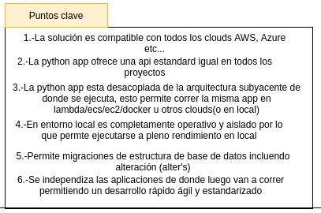
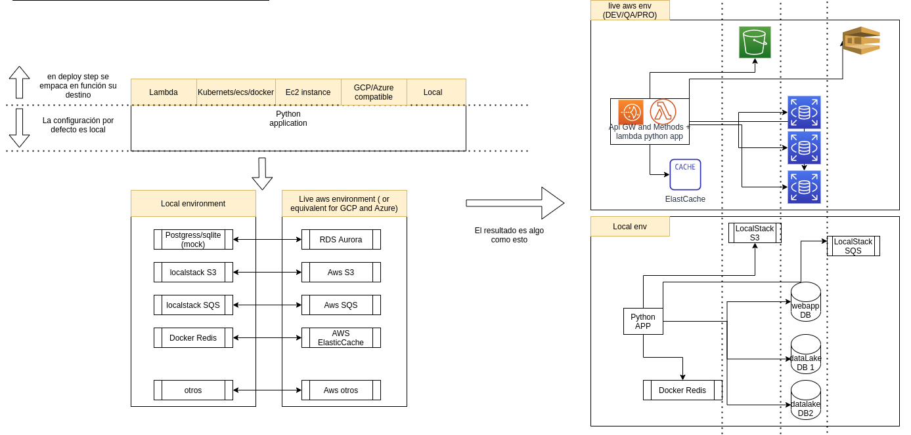

# Boileplate python backend api builder

Python backend-api desacoplada del entorno, puede  funcionar en lambda/ecs/docker/kubernets/ec2 o en cualquier cloud (AWS/GCP/Azure)

## Examples provided until now...

 - Relationship with FKey between tables /iniciativa/datalake/company/views.py
 - Example ML FrameWork /iniciativa/MLFrameWork and /iniciativa/datalake/company/views.py
 - Example RestApi CRUD /iniciativa/datalake/company/endpoints.py
 - Example dynamic table query /iniciativa/datalake/company/endpoints.py

## Key points
[]

## Arch

[]

Este boileplate esta adaptado para funcionar sobre lambdas con solo 5 minutos se puede dockerizar o puede correr directamente sobre una  ec2...

## Pre-requisitos
 - Java JRE(requisito)
 - NPM

## Preparar el entorno local
 - npm install -g serverless
 - npm install
 - virtualenv --python=python3.7 venv
 - source venv/bin/activate
 - pip install -r requirements.txt

## Iniciamos el servicio en local este caso emulando aws lambda
 - source venv/bin/activate
 - sls wsgi serve --port 5000

(http://localhost:5000/apidocs la generación de swagger y descubrimiento de endpoints es automatica)

## Migraciones de estructura de base de datos

Primero crea una nueva tabla o añade un campo a una existente
La migraciones se ejecutan en dos pasos:
 - Primer paso run `FLASK_APP=iniciativa flask db migrate`
(los cambios en las bd son detectados y los ficheros de migración generados /migrations/versions)
 - Segundo paso (revisa migración) aplicar los cambios a la bd run  `FLASK_APP=iniciativa flask db upgrade`

Las bases de datos se ha actualizado automaticamente y este fichero conforma parte de las migraciones automaticas que pueden subir en los diferentes entornos DEV/QA/PRO (estas se pueden ejecutar en jenkins o directamente al levantar la app)

## TO AWS Lambda
Run:

 - serverless package
 - aws s3 cp ./serverless/iniciativa.zip BUCKET_NAME
 - iac for lambda...

## TO ECS
TODO DockerFile

 - docker build . -t iniciativa:latest
 - docker push aws_account_id.dkr.ecr.region.amazonaws.com/iniciativa:latest
 - force reload task definition...

## TO EC2
TODO create app file 
Prepare user data

  - git clone repo 
  - virtualenv --python python3
  - source venv/bin/activate
  - pip install -r requirements.txt
  - python app.py
